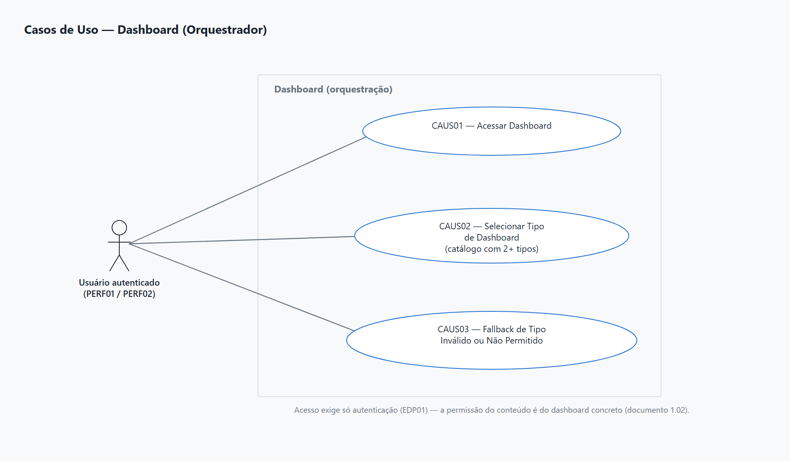
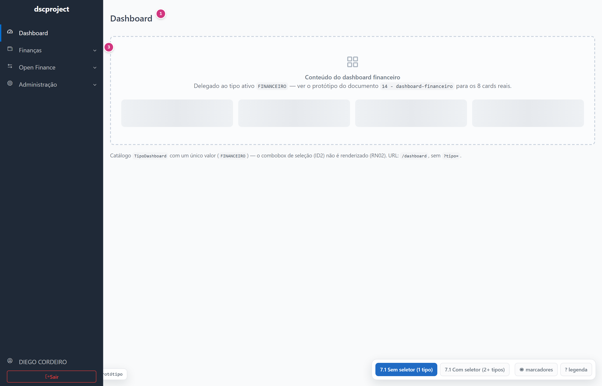
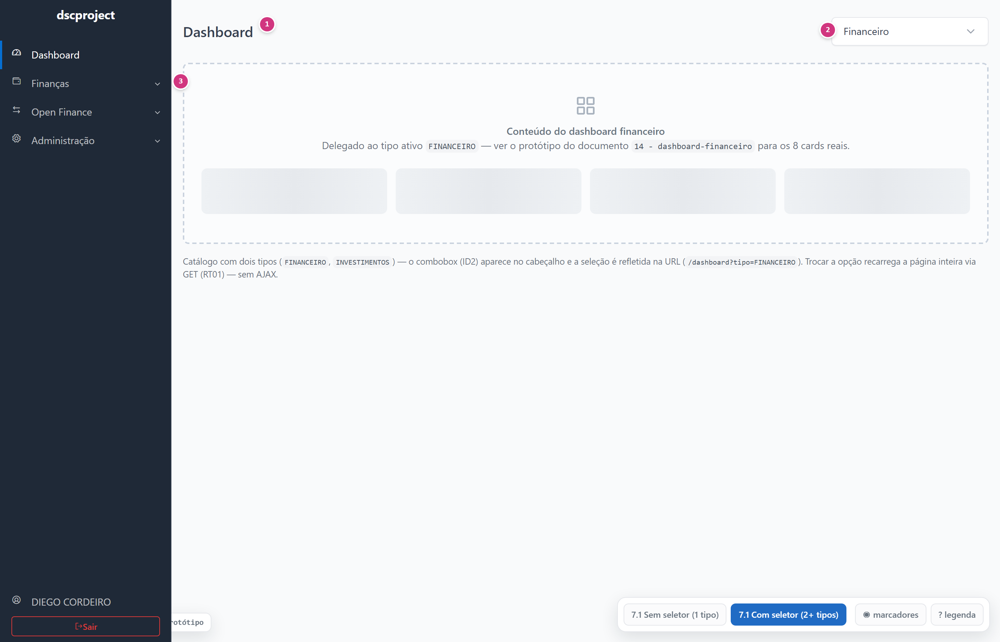

# dscproject — Análise de Sistemas
## Módulo Dashboard — USER / ADMIN — Orquestrador de Dashboard

**Gerado em:** 14/09/2026
**Versão:** 1.2
**Status:** Analisado
**Projeto:** `dscproject-spring-mvc` (geração 2)

---

## Informações sobre o Documento

| Órgão | dscproject | Setor | Pessoal |
|---|---|---|---|
| Plataforma | dscproject-spring-mvc | Disciplina | Documentação |
| Área Cliente | Diego Cordeiro | Versão do Modelo | 2 (padrão híbrido) |

## Revisões e Aprovações

| Responsável por | Nome | Data de Execução |
|---|---|---|
| Revisão | Diego dos Santos Cordeiro | — |

## Histórico de Versões

| Versão | Data | Analista Responsável | Descrição da Alteração |
|---|---|---|---|
| 1.0 | 14/09/2026 | Diego dos Santos Cordeiro | Criação do documento. Mecânica de **orquestração** de dashboards: catálogo de tipos em código (`enum TipoDashboard`, hoje com um único valor `FINANCEIRO`), substituição da tela inicial pós-login por `/dashboard`, exibição condicional de um seletor de tipo (só aparece a partir do 2º tipo cadastrado) e delegação da montagem de conteúdo ao módulo concreto de cada tipo. Não introduz tabela nova. O primeiro dashboard concreto (financeiro) é o documento `1.02 - dashboard-financeiro`. |
| 1.1 | 15/09/2026 | Diego dos Santos Cordeiro | Confirmação da única pendência da Seção 17: usuário autenticado sem permissão para o único dashboard disponível vê o estado vazio ([RN07](#rn07), [MSG02](#msg02)), sem redirecionamento nem HTTP 403. Corpo do documento fechado — Status avança para `Analisado` (D-CICLO-01). |
| 1.2 | 15/09/2026 | Diego dos Santos Cordeiro | Protótipo navegável e diagrama de casos de uso (Seção 7 e 4), no padrão Tabler Core 1.4.0 + Phosphor Icons 2.1.2 do design system real do projeto. Duas telas (sem seletor / com seletor de tipo). Sem DER — documento não lê tabela. |

---

## Diretrizes para Elaboração do Documento

| Nº | DIRETRIZ |
|---|---|
| D01 | As responsabilidades de camada são documentadas como **Regra de Tela (RT)** e **Regra de Negócio (RN)** — nunca "o backend deve" / "o frontend deve". |
| D02 | O termo `endpoint` é aceito na Seção 8. Fora dela, "chamada ao serviço". |
| D03 | A estrutura de dados é a do Documento 0 (`00 - analise-geral`). Este documento **não introduz tabela nova** e **não lê tabela alguma diretamente** — a leitura e o cálculo dos dados de cada dashboard concreto são responsabilidade do respectivo documento de análise (ex.: `1.02 - dashboard-financeiro`). |
| D04 | O catálogo de tipos de dashboard (`TipoDashboard`) vive **no código**, no mesmo padrão do catálogo de permissões (documento `5.02 - manter-perfil-permissao`) e do catálogo de parâmetros globais (documento `5.03 - manter-parametro-global`) — nunca em tabela nova. |

---

## 1. Introdução

Este documento descreve a **mecânica de orquestração de dashboards** do `dscproject-spring-mvc`: a rota `/dashboard`, que passa a ser a tela inicial exibida logo após o login, e a decisão de qual dashboard concreto renderizar.

Hoje existe um único tipo de dashboard — o financeiro (documento `1.02 - dashboard-financeiro`). O desenho já nasce pensado para múltiplos dashboards no futuro (por exemplo, um dashboard de investimentos ou de metas): o catálogo de tipos fica **no código**, não em tabela nova, seguindo o mesmo padrão já usado para o catálogo de permissões (documento `5.02`) e para o catálogo de parâmetros globais (documento `5.03`) — uma coleção conhecida no código, sincronizada ou simplesmente enumerada, nunca mantida por uma tela de CRUD.

Este documento cobre **apenas a mecânica de orquestração**:

- o **catálogo de tipos de dashboard**, hoje com um único valor (`FINANCEIRO`);
- a **decisão de exibir ou não um seletor de tipo** — enquanto houver só um tipo cadastrado, a tela renderiza esse tipo direto, sem nenhum combobox; a partir do 2º tipo, o seletor aparece e o tipo escolhido é refletido na URL (`?tipo=`);
- o **roteamento**: a rota `/dashboard` substitui a tela inicial atual pós-login — o item de menu e o título da tela passam a se chamar "Dashboard";
- o **contrato de extensão**: como um novo tipo de dashboard se conecta a esta mecânica sem exigir alteração deste documento nem do controlador de orquestração.

**Não contempla:**
- Os **cards, cálculos e regras** de qualquer dashboard concreto — isso é responsabilidade do documento de análise de cada tipo (o financeiro é o `1.02 - dashboard-financeiro`).
- Qualquer **tabela nova** — o catálogo de tipos é um enum no código, sem correspondência em banco.
- A **permissão de acesso ao conteúdo** de um dashboard concreto — cada tipo define e controla a própria permissão (ex.: `DASHBOARD_VISUALIZAR` no documento `1.02`). Este documento exige apenas que o usuário esteja **autenticado**.

**Perfis com acesso:** [PERF01](#perf01) (ADMIN) e [PERF02](#perf02) (USER). A rota `/dashboard` em si não exige nenhuma permissão granular — o que cada perfil vê dentro do dashboard depende do módulo concreto ativo.

---

## 2. Observações

| Nº | OBSERVAÇÃO | REFERÊNCIA / IMPACTO |
|---|---|---|
| 1 | **O catálogo de tipos vive no código, nunca em tabela.** Um `enum TipoDashboard` (código, rótulo de exibição, ordem, nome do fragmento/template que renderiza o conteúdo daquele tipo) é a única fonte da lista de dashboards disponíveis. Não existe `PARAMETROS_GLOBAIS`, `PERMISSOES` nem tabela nova envolvida — o padrão aqui é mais simples que o dos documentos `5.02`/`5.03` porque não há nada para persistir (não há "valor editável" nem "vínculo perfil × item"): é só uma lista fixa de tipos, cada um resolvido para uma implementação concreta. | [RN01](#rn01) |
| 2 | **Hoje existe um único tipo: `FINANCEIRO`.** Enquanto o catálogo tiver exatamente um valor, a tela renderiza esse tipo direto — nenhum seletor aparece, mesmo que o código já preveja múltiplos tipos no futuro. | [RN02](#rn02), [RF03](#rf03) |
| 3 | **Seletor a partir do 2º tipo.** Quando um segundo valor for adicionado ao catálogo, a tela passa automaticamente a exibir um combobox de seleção de tipo, sem qualquer alteração nesta mecânica — a condição "existe mais de um tipo" já é avaliada dinamicamente a partir do tamanho do catálogo. O tipo escolhido é refletido na URL (`?tipo=CODIGO`), permitindo *bookmark* e compartilhamento do link. | [RN02](#rn02), [RN03](#rn03) |
| 4 | **Extensibilidade sem alterar este documento.** Acrescentar um novo tipo de dashboard no futuro exige apenas: (a) um novo valor no `enum TipoDashboard`; (b) uma implementação do contrato de renderização para aquele tipo (uma classe de serviço registrada para o novo valor do enum); e (c) o documento de análise do novo dashboard concreto, no padrão do `1.02`. A mecânica de orquestração — catálogo, decisão de exibir o seletor, roteamento — não muda. | [RN05](#rn05) |
| 5 | **Substitui a tela inicial pós-login.** A rota que hoje serve de tela inicial passa a ser `/dashboard`. O item de menu e o título da tela mudam para "Dashboard". Não há mais uma tela de boas-vindas genérica separada. | [RF01](#rf01) |
| 6 | **Permissão de conteúdo é do módulo concreto, não da orquestração.** `/dashboard` exige apenas usuário autenticado. Quem controla se o conteúdo aparece (e o quê) é o próprio dashboard concreto, com a sua própria permissão granular — no financeiro, `DASHBOARD_VISUALIZAR` (documento `1.02`). Se o único tipo disponível não for permitido para o usuário autenticado, a tela exibe um estado vazio amigável em vez de um erro técnico (403) — comportamento confirmado (v1.1). | [RN06](#rn06), [RN07](#rn07) |
| 7 | **Sem AJAX.** Toda troca de tipo de dashboard (quando o seletor existir) recarrega a página inteira via GET, seguindo a diretriz do projeto de evitar AJAX fora de casos de extrema dificuldade. Não há endpoint JSON nesta mecânica. | [RNF02](#rnf02) |

---

## 3. Requisitos

### 3.1 Requisitos Funcionais

| ID | DESCRIÇÃO | PRIORIDADE | SITUAÇÃO |
|---|---|---|---|
| <a id="rf01"></a>RF01 | O sistema deve substituir a tela inicial pós-login pela tela "Dashboard", acessível em `/dashboard`. | Alta | Em análise |
| <a id="rf02"></a>RF02 | O sistema deve manter um catálogo de tipos de dashboard **no código** (`enum TipoDashboard`), sem tabela de banco correspondente. | Alta | Em análise |
| <a id="rf03"></a>RF03 | O sistema deve renderizar diretamente o dashboard do único tipo cadastrado no catálogo quando houver apenas um, sem exibir nenhum seletor. | Alta | Em análise |
| <a id="rf04"></a>RF04 | O sistema deve exibir um combobox de seleção de tipo de dashboard quando o catálogo tiver dois ou mais tipos cadastrados. | Média | Em análise |
| <a id="rf05"></a>RF05 | O sistema deve refletir o tipo de dashboard selecionado na URL (`?tipo=`) quando o seletor estiver visível, e recarregar a página inteira via GET ao trocar a seleção. | Média | Em análise |
| <a id="rf06"></a>RF06 | O sistema deve permitir que um novo tipo de dashboard seja adicionado registrando um novo valor no catálogo e implementando o módulo concreto correspondente, sem exigir alteração desta mecânica de orquestração. | Alta | Em análise |
| <a id="rf07"></a>RF07 | O sistema deve exigir apenas autenticação para acessar `/dashboard`; a permissão de exibição do conteúdo de cada dashboard concreto é responsabilidade do respectivo módulo. | Alta | Em análise |
| <a id="rf08"></a>RF08 | O sistema deve tratar um `tipo` informado na URL que não exista no catálogo, retornando ao tipo padrão sem erro técnico. | Média | Em análise |

### 3.2 Requisitos Não Funcionais

| ID | CATEGORIA | DESCRIÇÃO | CRITÉRIO DE ACEITAÇÃO |
|---|---|---|---|
| <a id="rnf01"></a>RNF01 | Segurança | `/dashboard` exige usuário autenticado ([EDP01](#edp01)). Nenhuma permissão granular é verificada nesta camada — a permissão de conteúdo é do módulo concreto. | Teste de acesso anônimo (redireciona ao login) e autenticado (renderiza). |
| <a id="rnf02"></a>RNF02 | Usabilidade | A interface segue o padrão do projeto (Thymeleaf + Tabler) e é responsiva. Toda troca de tipo recarrega a página inteira via GET — nenhum endpoint JSON ou chamada AJAX nesta mecânica. | Revisão visual e inspeção de rede ao trocar o seletor. |
| <a id="rnf03"></a>RNF03 | Extensibilidade | Adicionar um novo tipo ao catálogo não exige alterar o controlador de orquestração nem este documento — apenas o enum e a implementação do novo módulo. | *Code review*: o *diff* de um novo tipo se restringe ao enum e à nova implementação. |
| <a id="rnf04"></a>RNF04 | Desempenho | A resolução do tipo ativo e a decisão de exibir o seletor respondem em menos de 100 ms — o custo de desempenho da tela está no dashboard concreto delegado. | Medição em homologação. |

---

## 4. Casos de Uso



| CÓDIGO | NOME | ATOR PRINCIPAL | DESCRIÇÃO |
|---|---|---|---|
| <a id="caus01"></a>CAUS01 | Acessar Dashboard | [PERF01](#perf01), [PERF02](#perf02) | Usuário autenticado é direcionado a `/dashboard` (pós-login ou pelo menu) e visualiza o dashboard do tipo ativo. ([RF01](#rf01), [RF03](#rf03)) |
| <a id="caus02"></a>CAUS02 | Selecionar Tipo de Dashboard | [PERF01](#perf01), [PERF02](#perf02) | Com dois ou mais tipos cadastrados, o usuário escolhe outro tipo no combobox; a página recarrega via GET com o novo tipo na URL. ([RF04](#rf04), [RF05](#rf05)) |
| <a id="caus03"></a>CAUS03 | Fallback de Tipo Inválido ou Não Permitido | [PERF01](#perf01), [PERF02](#perf02) | Usuário acessa `/dashboard?tipo=X` com um tipo inexistente no catálogo, ou sem permissão para o único tipo disponível; o sistema recupera com o padrão ou um estado vazio, sem erro técnico. ([RF08](#rf08)) |

---

## 5. Localização / Critérios de Aceitação

**Caminho de Navegação:**
- Menu principal > Dashboard (rótulo do menu: "Dashboard"; título da tela: "Dashboard"). É também a tela para a qual o login bem-sucedido redireciona.

**Critérios de Aceitação:**
- Após o login, o usuário é direcionado a `/dashboard`.
- Com um único tipo no catálogo, a tela renderiza esse tipo direto — nenhum seletor aparece.
- Com dois ou mais tipos no catálogo, um combobox de tipo é exibido, e a URL reflete o tipo ativo (`?tipo=`).
- Trocar o tipo no seletor recarrega a página inteira via GET — sem AJAX.
- Um `tipo` inexistente no catálogo não gera erro técnico: a tela recupera com o tipo padrão.
- O acesso a `/dashboard` exige apenas autenticação; a permissão de conteúdo é do módulo concreto ativo.

---

## 6. Banco de Dados

Este documento **não introduz nem altera nenhuma tabela**. O catálogo de tipos de dashboard (`TipoDashboard`) é um `enum` no código — não corresponde a nenhuma linha de tabela, ao contrário dos catálogos de permissões ([QUADRO_DESCRITIVO_26](../../00%20-%20analise-geral/documento-0-fundacao.md#quadro-descritivo-26)) e de parâmetros globais ([QUADRO_DESCRITIVO_28](../../00%20-%20analise-geral/documento-0-fundacao.md#quadro-descritivo-28)), que são sincronizados numa tabela para permitir vínculo com perfil ou edição de valor. Aqui não há nada disso: é uma lista fixa resolvida inteiramente em tempo de execução (ver [Observação 1](#2-observações)).

A leitura de dados de negócio (contas, receitas, despesas etc.) é feita exclusivamente pelo dashboard concreto ativo — ver o documento correspondente (ex.: `1.02 - dashboard-financeiro`).

### 6.1 Diagrama ER

Não aplicável — nenhuma tabela neste documento.

### 6.2 Auditoria de Tabelas

Não aplicável — nenhuma tabela neste documento.

### 6.3 Procedures / Views / Triggers / Functions

Nenhuma.

---

## 7. Protótipos de Interface

Protótipo navegável e diagramas: `prototipo/dashboard-prototipo.html` e `prototipo/_diagrama-casos-uso.html`. Sem DER — este documento não lê nenhuma tabela ([Seção 6](#6-banco-de-dados)). Os números em destaque nas telas correspondem aos IDs do QUADRO_DESCRITIVO_1 abaixo.

### <a id="quadro-descritivo-1"></a>7.1 Tela: Dashboard (Orquestração) — QUADRO_DESCRITIVO_1

> OBSERVAÇÕES: Tela pós-login, acessada via `/dashboard` ou pelo menu "Dashboard". Restrita a usuário autenticado. A área de conteúdo ([ID3](#qdd1-3)) é inteiramente delegada ao dashboard concreto do tipo ativo — este quadro descreve apenas o invólucro da orquestração.

**Catálogo com um único tipo (hoje) — sem seletor ([RN02](#rn02)):**



**Catálogo com dois ou mais tipos — seletor visível ([RN02](#rn02), [RN03](#rn03)):**



| ID | NOME | PROPRIEDADES | OBSERVAÇÕES |
|---|---|---|---|
| <a id="qdd1-0"></a>0 | LINK | Caminho: "/dashboard" | — |
| <a id="qdd1-1"></a>1 | TÍTULO DA TELA | Tipo: Texto<br>Texto: Dashboard | — |
| <a id="qdd1-2"></a>2 | SELETOR DE TIPO DE DASHBOARD | Tipo: Combobox<br>Obrigatório: Não<br>Exibição: condicional (só quando o catálogo tem 2+ tipos) | Domínio: [SB01](#sb01). Ao trocar, executar [RT01](#rt01). Oculto por completo enquanto houver apenas um tipo cadastrado ([RN02](#rn02)). |
| <a id="qdd1-3"></a>3 | ÁREA DE CONTEÚDO DO DASHBOARD | Tipo: Fragmento (Thymeleaf, incluído dinamicamente) | Renderiza o conteúdo do dashboard concreto do tipo ativo, resolvido por [RN04](#rn04). Ver o documento do tipo ativo (ex.: `1.02 - dashboard-financeiro`) para o conteúdo em si. |

### 7.2 Suggestion Boxes

| ID | NOME | DESCRIÇÃO |
|---|---|---|
| <a id="sb01"></a>SB01 | TIPO DE DASHBOARD | Itens vindos do catálogo `TipoDashboard` do código (não de tabela): código e rótulo de exibição de cada tipo, na ordem declarada. Nunca `<option>` fixo no HTML — a lista cresce junto com o enum. |

### 7.3 Regras de Tela

| ID | DESCRIÇÃO |
|---|---|
| <a id="rt01"></a>RT01 | Ao trocar a seleção em [ID2](#qdd1-2), recarregar a página inteira via GET em `/dashboard?tipo={código escolhido}` — sem AJAX. |
| <a id="rt02"></a>RT02 | Ao carregar `/dashboard` sem `tipo` na URL, usar o tipo padrão resolvido por [RN02](#rn02)/[RN03](#rn03) e, se o seletor estiver visível, refletir esse tipo como selecionado. |

---

## 8. Endpoints

| CÓDIGO | HTTP | PERMISSÃO | PATH | FINALIZADO? |
|---|---|---|---|---|
| <a id="edp01"></a>EDP01 | GET | Autenticado | /dashboard | N |
| Retorna a página do Dashboard (Thymeleaf), renderizada por completo no servidor. Executa [RN01](#rn01)–[RN07](#rn07): resolve o catálogo de tipos, decide o tipo ativo (parâmetro de querystring `tipo`, opcional), decide se o seletor aparece, delega a montagem do conteúdo ao dashboard concreto do tipo ativo e inclui o fragmento resultante na página. Parâmetro: `tipo` (opcional; string, código de `TipoDashboard`). Parâmetros adicionais específicos de cada dashboard concreto (ex.: `competencia` no financeiro) são lidos e tratados inteiramente pelo módulo delegado — ver o documento do tipo ativo. Sem retorno JSON: a resposta é sempre a página completa. | | | | |

---

## 9. Regras de Negócio

| ID | DESCRIÇÃO |
|---|---|
| <a id="rn01"></a>RN01 | O catálogo de tipos de dashboard é o `enum TipoDashboard` do código — nenhuma tabela é lida ou gravada para compor a lista de tipos disponíveis. Cada valor do enum carrega: código (usado em `?tipo=`), rótulo de exibição (usado no seletor) e a referência à implementação que monta o conteúdo daquele tipo. |
| <a id="rn02"></a>RN02 | **Decisão de exibir o seletor.** Se o catálogo tiver exatamente um tipo, esse tipo é sempre o ativo — o parâmetro `tipo` da requisição é ignorado quando presente, e o seletor ([ID2](#qdd1-2)) não é renderizado. Se o catálogo tiver dois ou mais tipos, o seletor é renderizado e o tipo ativo é resolvido por [RN03](#rn03). |
| <a id="rn03"></a>RN03 | **Resolução do tipo ativo (catálogo com 2+ tipos).** Se `tipo` foi informado na querystring e corresponde a um código existente no catálogo, esse é o tipo ativo. Caso contrário (`tipo` ausente ou inexistente no catálogo), o tipo ativo é o padrão — o primeiro tipo do catálogo, na ordem declarada no enum — e [MSG01](#msg01) é exibida quando um `tipo` foi informado mas não reconhecido. |
| <a id="rn04"></a>RN04 | **Delegação ao módulo concreto.** Resolvido o tipo ativo ([RN02](#rn02)/[RN03](#rn03)), o orquestrador invoca a implementação registrada para aquele tipo, que monta o modelo (dados) e devolve o fragmento a incluir na página. Nenhuma lógica de card, cálculo financeiro ou consulta a tabela de domínio vive neste documento — está inteiramente no documento do tipo ativo (ex.: `1.02 - dashboard-financeiro`). |
| <a id="rn05"></a>RN05 | **Extensibilidade.** Adicionar um novo tipo de dashboard exige exclusivamente: (a) um novo valor no `enum TipoDashboard`; (b) uma implementação do contrato de renderização registrada para esse novo valor; (c) o documento de análise do novo dashboard concreto. Este documento (a mecânica de orquestração) e o controlador de `/dashboard` não são alterados. |
| <a id="rn06"></a>RN06 | `/dashboard` ([EDP01](#edp01)) exige apenas usuário autenticado. Não há verificação de permissão granular nesta camada — cada dashboard concreto verifica a própria permissão antes de montar o conteúdo (ex.: `DASHBOARD_VISUALIZAR` no documento `1.02`, sobre a permissão do usuário). |
| <a id="rn07"></a>RN07 | **Sem conteúdo disponível para o usuário.** Se o tipo ativo delegar a montagem e o módulo concreto recusar por falta de permissão, o orquestrador exibe um estado vazio amigável ([MSG02](#msg02)) na área de conteúdo ([ID3](#qdd1-3)), em vez de um erro HTTP 403 — a tela `/dashboard` é o destino do pós-login para **todo** usuário autenticado, independentemente do perfil. Comportamento confirmado (v1.1) — não há redirecionamento a outra tela nem HTTP 403. |

---

## 10. Mensagens de Sistema

| CÓDIGO | DESCRIÇÃO |
|---|---|
| <a id="msg01"></a>MSG01 | O tipo de dashboard informado não foi encontrado; exibindo o dashboard padrão. |
| <a id="msg02"></a>MSG02 | Você não tem permissão para visualizar nenhum dashboard disponível no momento. |

---

## 11. Consultas

Nenhuma consulta SQL neste documento — a orquestração não lê tabela de domínio alguma. A leitura de dados fica inteiramente a cargo de cada dashboard concreto (ver, por exemplo, a Seção 11 do documento `1.02 - dashboard-financeiro`).

---

## 12. Parâmetros de Sistema

Nenhum parâmetro novo. A mecânica de orquestração não depende de nenhum valor configurável — o catálogo de tipos é fixo no código (enum), não um parâmetro editável.

---

## 13. Permissões

Este documento **não define nenhuma permissão nova**. O acesso a `/dashboard` ([EDP01](#edp01)) exige apenas que o usuário esteja autenticado — sem autoridade (`PERM_*`) associada. A permissão de exibição do conteúdo é responsabilidade de cada dashboard concreto (ex.: `DASHBOARD_VISUALIZAR`, definida no documento `1.02 - dashboard-financeiro`).

### 13.1 Matriz Perfil × Permissão

Não aplicável — nenhuma permissão é definida neste documento.

---

## 14. Perfis

| CÓDIGO | NOME | DESCRIÇÃO |
|---|---|---|
| <a id="perf01"></a>PERF01 | ADMIN | Administrador do sistema. `PERF_FL_SISTEMA = TRUE`. Acessa `/dashboard` como qualquer usuário autenticado; o conteúdo exibido depende do dashboard concreto ativo e da própria permissão do ADMIN naquele módulo. Corresponde a `ROLE_ADMIN`. |
| <a id="perf02"></a>PERF02 | USER | Usuário comum. `PERF_FL_SISTEMA = TRUE`. Acessa `/dashboard` como qualquer usuário autenticado, nas mesmas condições do ADMIN. Corresponde a `ROLE_USER`. |

---

## 15. Fluxo de Eventos

**Acessar `/dashboard`:**

```
1. Usuário autenticado acessa "/dashboard" (pós-login ou pelo menu).
2. Sistema carrega o catálogo TipoDashboard.
        │
        ├─ Catálogo com 1 tipo         → tipo ativo = esse tipo; ID2 (seletor) oculto (RN02).
        │
        └─ Catálogo com 2+ tipos
                │
                ├─ "tipo" na URL existe no catálogo   → tipo ativo = esse (RN03).
                └─ "tipo" ausente ou inexistente       → tipo ativo = padrão (1º do catálogo);
                                                          MSG01 se "tipo" foi informado e não reconhecido.
                   ID2 (seletor) visível, refletindo o tipo ativo.
3. Sistema delega a montagem do conteúdo ao módulo do tipo ativo (RN04).
        │
        ├─ Módulo recusa por falta de permissão do usuário → área de conteúdo exibe MSG02 (RN07).
        └─ Módulo monta o conteúdo normalmente             → fragmento incluído em ID3.
4. Página renderizada por completo (sem AJAX).
```

**Trocar o tipo de dashboard (catálogo com 2+ tipos):**

```
1. Usuário seleciona outro tipo no combobox (ID2).
2. Navegador faz GET "/dashboard?tipo={código escolhido}" (RT01).
3. Sistema repete o fluxo "Acessar /dashboard" a partir do passo 2.
```

---

## 16. Critérios de Aceitação / BDD

### 16.0 Renderização direta com um único tipo cadastrado

Dado que o catálogo `TipoDashboard` possui apenas o valor `FINANCEIRO`.
E que estou autenticado.
Quando eu acessar "/dashboard".
Então o sistema deve renderizar diretamente o dashboard financeiro.
E nenhum seletor de tipo deve aparecer na tela.

### 16.1 Seletor exibido a partir do 2º tipo

Dado que o catálogo `TipoDashboard` possui dois valores, `FINANCEIRO` e `INVESTIMENTOS`.
Quando eu acessar "/dashboard".
Então o sistema deve exibir um combobox com os dois tipos.
E o tipo ativo deve ser o padrão (o primeiro do catálogo), refletido na URL.

### 16.2 Trocar o tipo pelo seletor

Dado que o catálogo possui os tipos `FINANCEIRO` e `INVESTIMENTOS`, e estou no dashboard `FINANCEIRO`.
Quando eu selecionar "INVESTIMENTOS" no combobox.
Então o sistema deve recarregar a página inteira via GET em "/dashboard?tipo=INVESTIMENTOS".
E o conteúdo exibido deve ser o do dashboard de Investimentos.

### 16.3 Tipo inexistente na URL cai no padrão

Dado que o catálogo possui apenas `FINANCEIRO`.
Quando eu acessar "/dashboard?tipo=INEXISTENTE".
Então o sistema deve exibir o dashboard `FINANCEIRO` (o padrão).
E exibir [MSG01](#msg01).

### 16.4 Acesso exige apenas autenticação

Dado que não estou autenticado.
Quando eu tentar acessar "/dashboard".
Então o sistema deve redirecionar para o login, como em qualquer outra tela protegida.

### 16.5 Estado vazio quando o usuário não tem permissão no único tipo disponível

Dado que o catálogo possui apenas `FINANCEIRO` e meu perfil não tem `DASHBOARD_VISUALIZAR`.
Quando eu acessar "/dashboard".
Então o sistema não deve retornar erro HTTP 403.
E a área de conteúdo deve exibir [MSG02](#msg02).

---

## 17. Workshop de Análise

Data: 14/09/2026
Convidados: Diego Cordeiro
Participantes: Diego Cordeiro
Descrição: Sessão de brainstorming sobre a mecânica de seleção de dashboard, pensada desde já para múltiplos tipos no futuro, ainda que hoje só exista o financeiro. Decisão de manter o catálogo em código, no mesmo espírito dos catálogos de permissões (documento `5.02`) e de parâmetros globais (documento `5.03`), mas sem a complexidade de sincronização com tabela — aqui não há nada para persistir.

**Decisões tomadas:**
- Catálogo de tipos de dashboard **em código** (`enum TipoDashboard`), sem tabela nova. Hoje com um único valor, `FINANCEIRO`.
- `/dashboard` substitui a tela inicial pós-login; menu e título passam a se chamar "Dashboard".
- Seletor de tipo **só aparece a partir do 2º tipo cadastrado**; com um único tipo, renderização direta sem combobox.
- Quando o seletor existe, o tipo ativo é refletido na URL (`?tipo=`); trocar a seleção recarrega a página inteira via GET, sem AJAX.
- Este documento cobre **só a mecânica**; nenhum card ou regra de cálculo financeiro é descrito aqui — isso é do documento do tipo concreto (o financeiro é o `1.02`).
- Novo tipo de dashboard no futuro = novo valor no enum + implementação do módulo + documento de análise próprio; a mecânica de orquestração não muda.
- **(v1.1)** Usuário autenticado sem permissão para o único dashboard disponível: **confirmado** o estado vazio amigável ([RN07](#rn07), [MSG02](#msg02)) em vez de bloquear o acesso a `/dashboard` com 403 ou redirecionar a outra tela — a tela é o destino padrão pós-login de qualquer perfil autenticado.

**A Confirmar:**
- Nome exato do fragmento/contrato de extensão (interface Java que cada dashboard concreto implementa) é decisão técnica do `desenvolvedor-java`; este documento fixa apenas o comportamento observável (catálogo, seletor condicional, delegação). Item menor — não bloqueia o Status `Analisado`.
- Se, no futuro, cada tipo de dashboard precisar de parâmetros de querystring conflitantes entre si (dois tipos usando o mesmo nome de parâmetro com semânticas diferentes), definir a convenção de nomenclatura nesse momento — fora de escopo enquanto há um único tipo. Item menor — não bloqueia o Status `Analisado`.

---

## 18. Anexos

- Documento 0 — Fundação: `../../00 - analise-geral/documento-0-fundacao.md` (nenhuma tabela referenciada — este documento não lê banco).
- Documento `5.02 - manter-perfil-permissao`: `../../5 - administracao/5.02 - manter-perfil-permissao/documento-analise-manter-perfil-permissao.md` (padrão de catálogo em código espelhado aqui, sem a parte de sincronização/persistência).
- Documento `5.03 - manter-parametro-global`: `../../5 - administracao/5.03 - manter-parametro-global/documento-analise-manter-parametro-global.md` (padrão de catálogo em código espelhado aqui, sem a parte de sincronização/persistência).
- Documento `1.02 - dashboard-financeiro`: `../1.02 - dashboard-financeiro/documento-analise-dashboard-financeiro.md` (primeiro e único dashboard concreto desta versão; consome a delegação [RN04](#rn04)).
- **Protótipo e diagramas (v1.2):** protótipo navegável (`prototipo/dashboard-prototipo.html`, Tabler Core 1.4.0 + Phosphor Icons 2.1.2 via CDN) com as duas telas (sem seletor / com seletor) e casos de uso (`prototipo/_diagrama-casos-uso.html` + `images/dashboard-casos-uso.png`). PNGs gerados por `prototipo/render-pngs.py` (Playwright). Sem DER — documento sem tabela.
