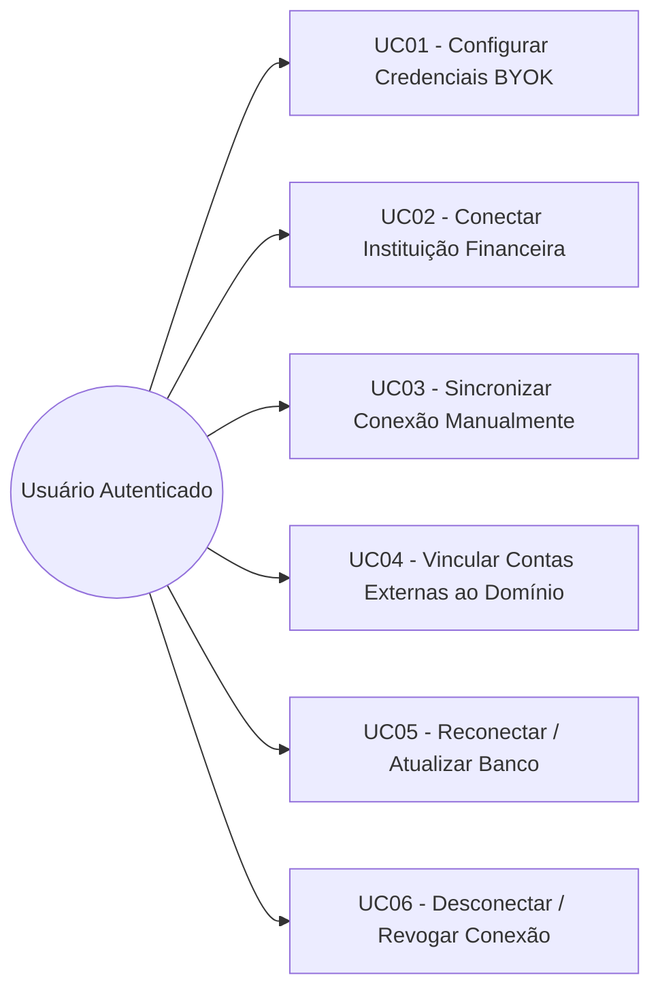
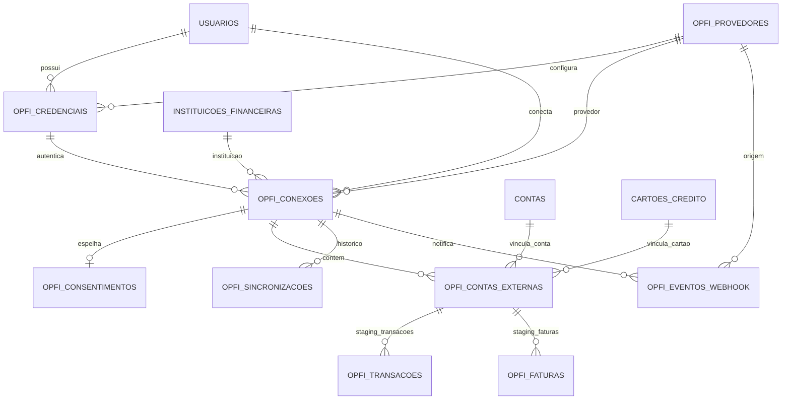
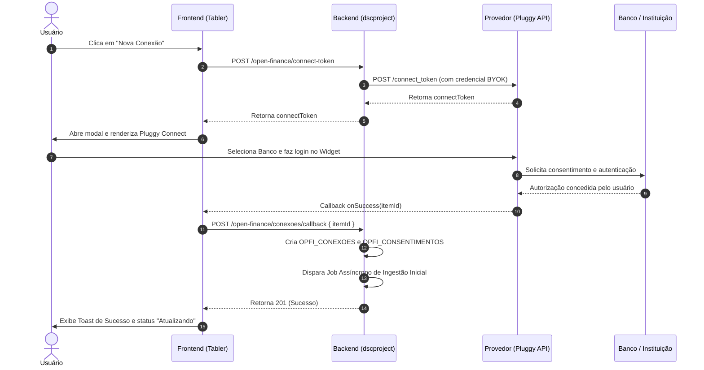
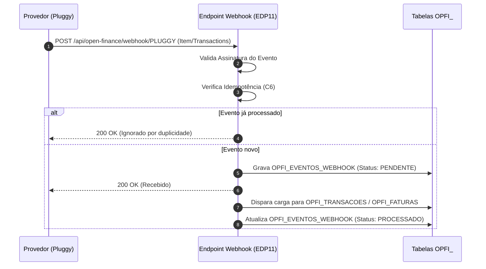

# dscproject — Análise de Sistemas
## Módulo Open Finance — USER / ADMIN — Conectar Conta

**Gerado em:** 17/09/2026  
**Atualizado em:** 17/09/2026  
**Versão:** 1.0  
**Status:** Analisado  
**Projeto:** `dscproject-spring-mvc` (geração 2)  

---

## Informações sobre o Documento

| Órgão | dscproject | Setor | Pessoal |
|---|---|---|---|
| Plataforma | dscproject-spring-mvc | Disciplina | Documentação |
| Área Cliente | Diego Cordeiro | Versão do Modelo | 2 (padrão híbrido) |

## Revisões e Aprovações

| Responsável por | Nome | Data de Execução |
|---|---|---|
| Revisão | Diego dos Santos Cordeiro | — |

## Histórico de Versões

| Versão | Data | Analista Responsável | Descrição da Alteração |
|---|---|---|---|
| 1.0 | 17/09/2026 | Diego dos Santos Cordeiro | Criação do documento. Gestão da **camada de conexão Open Finance** (tela "Finanças > Conexões Open Finance" / `/open-finance/conexoes`) para a geração 2, cobrindo as tabelas `OPFI_CREDENCIAIS`, `OPFI_CONEXOES`, `OPFI_CONSENTIMENTOS`, `OPFI_CONTAS_EXTERNAS`, `OPFI_EVENTOS_WEBHOOK` e `OPFI_SINCRONIZACOES` ([QUADRO_DESCRITIVO_16 a 24 do Documento 0](../00%20-%20analise-geral/documento-0-fundacao.md)). Define o modelo de credenciais BYOK (*Bring Your Own Key*) com segredo cifrado simetricamente via AES-256, integração com o widget JavaScript oficial do agregador (Pluggy Connect), espelhamento do ciclo de vida regulatório de consentimento, mapeamento de contas e cartões trazidos do provedor para o domínio (`CONTAS` e `CARTOES_CREDITO`), recepção assíncrona de webhooks com idempotência e ingestão inicial/periódica de dados brutos para as tabelas de *staging* (`OPFI_TRANSACOES` e `OPFI_FATURAS`). Escopo *row-level* por usuário autenticado. Este documento **referencia** os QUADRO_DESCRITIVO do Documento 0 e **não introduz tabela nova**. |

---

## Diretrizes para Elaboração do Documento

| Nº | DIRETRIZ |
|---|---|
| D01 | As responsabilidades de camada são documentadas como **Regra de Tela (RT)** e **Regra de Negócio (RN)** — nunca "o backend deve" / "o frontend deve". |
| D02 | O termo `endpoint` é aceito na Seção 8. Fora dela, "chamada ao serviço". |
| D03 | A estrutura de dados é a do Documento 0 (`00 - analise-geral`). Este documento **referencia** os QUADRO_DESCRITIVO do Documento 0 e **não introduz tabela nova** nem altera schema. |
| D04 | Toda credencial, conexão, consentimento e conta externa pertence estritamente ao usuário autenticado (`USU_ID`). O escopo por usuário (*row-level*) é sempre resolvido **no serviço**, a partir do contexto de segurança — inclusive para o `ADMIN` (nenhum usuário visualiza conexões bancárias de terceiros). Acesso cruzado por id responde 404 sem vazar informações. |
| D05 | **Isolamento Total de Staging (*Zero Direct Domain Write*):** O job de sincronização e a recepção de webhooks gravam dados brutos estritamente nas tabelas de *staging* (`OPFI_TRANSACOES` e `OPFI_FATURAS`). Nenhuma tabela financeira do domínio (`RECEITAS`, `DESPESAS`, `TRANSACOES_BANCARIAS`, `FATURAS_CARTAO`) é alterada diretamente por este módulo; a conversão em lançamentos contábeis é de responsabilidade exclusiva do módulo `16 - open-finance-conciliacao`. |

---

## 1. Introdução

Este documento descreve a funcionalidade **Conectar Conta Open Finance** do `dscproject-spring-mvc` — a gestão da camada de comunicação entre o sistema e os agregadores regulados de Open Finance (iniciando pela **Pluggy**, com arquitetura extensível via *Strategy Pattern* para outros provedores como Belvo ou APIs proprietárias).

Na **geração 1** (API REST + SPA Angular), a integração automatizada com bancos **não existia**. Toda alimentação de movimentações dependia de digitação manual ou do upload avulso de arquivos OFX e planilhas Excel.

O **Documento 0** ([QUADRO_DESCRITIVO_13 a 24](../00%20-%20analise-geral/documento-0-fundacao.md), Observações 1a, 18a, 19 e 20) consolidou a arquitetura Open Finance da geração 2:
- **O domínio é 100% autônomo:** o sistema funciona plenamente sem nenhuma conexão de Open Finance. A integração é uma fonte de entrada e automação opcional.
- **Abstração de Provedor (Strategy Pattern):** o sistema interage com uma interface Java padronizada `OpenFinanceProviderStrategy`, desacoplando a aplicação dos detalhes de implementação de um provedor específico. O catálogo `OPFI_PROVEDORES` gerencia os provedores habilitados.
- **Credenciais BYOK (*Bring Your Own Key*):** cada usuário pode configurar suas próprias credenciais de acesso à API do agregador (`OPFI_CREDENCIAIS`), com suporte a ambientes de testes (`SANDBOX`) e homologação/produção (`PRODUCTION`). O segredo (`clientSecret`) é gravado de forma estritamente cifrada por chave simétrica gerenciada fora da base de dados.
- **Widget Oficial do Agregador:** a autenticação do usuário junto ao seu banco ocorre com total segurança dentro do widget JavaScript embutido fornecido pelo agregador (Pluggy Connect), garantindo que credenciais bancárias e senhas trafeguem unicamente entre o usuário e sua instituição financeira.
- **Gestão do Consentimento Regulatório:** a plataforma espelha a vigência e os escopos do consentimento formal (`OPFI_CONSENTIMENTOS`), alertando o usuário sobre a proximidade da expiração (prazo regulatório padrão de até 12 meses) e viabilizando a renovação ou revogação direta.
- **Mapeamento de Contas e Cartões:** uma vez estabelecida a conexão, as contas de depósito e cartões de crédito externos descobertos (`OPFI_CONTAS_EXTERNAS`) são apresentados ao usuário para que sejam vinculados às entidades correspondentes do domínio (`CONTAS` e `CARTOES_CREDITO`).
- **Ingestão Assíncrona e Webhooks:** o módulo fornece um endpoint público e seguro para recepção de webhooks com garantia de idempotência (`OPFI_EVENTOS_WEBHOOK`), acionando rotinas de sincronização que atualizam saldos e alimentam as tabelas de *staging* (`OPFI_TRANSACOES`, `OPFI_FATURAS`).

Este documento cobre:
- A **tela de Minhas Conexões Open Finance** (`/open-finance/conexoes`): listagem de instituições conectadas, status, datas de sincronização e contas vinculadas;
- O **modal de configuração de credenciais do provedor** (modelo BYOK com segredo cifrado e validação de conectividade);
- O **modal de conexão bancária com widget Pluggy Connect** integrado;
- O **modal de gerenciamento de contas externas** (vínculo com `CONTAS` e `CARTOES_CREDITO` do domínio);
- A ação de **sincronização manual sob demanda** ("Sincronizar agora");
- A ação de **desconexão e revogação de consentimento**;
- A **recepção e processamento de webhooks** do agregador com controle de idempotência;
- O **registro de auditoria das execuções de sincronização** (`OPFI_SINCRONIZACOES`).

**Escopo deste documento:**
- Configuração de credenciais do provedor (`OPFI_CREDENCIAIS`) por usuário.
- Geração de `connectToken` temporário junto à API do agregador.
- Abertura e ciclo de vida do widget Pluggy Connect em modal na interface Tabler.
- Callback pós-conexão para persistência do item de conexão (`OPFI_CONEXOES`) e espelho de consentimento (`OPFI_CONSENTIMENTOS`).
- Sincronização e listagem das contas e cartões externos (`OPFI_CONTAS_EXTERNAS`).
- Interface para associação entre contas externas e contas/cartões do sistema.
- Carga de extrato e lançamentos para as tabelas de *staging* (`OPFI_TRANSACOES` e `OPFI_FATURAS`).
- Endpoint de webhook com verificação de assinatura e idempotência (`OPFI_EVENTOS_WEBHOOK`).
- Definição das permissões atômicas `OPEN_FINANCE_LISTAR`, `OPEN_FINANCE_CONECTAR`, `OPEN_FINANCE_SINCRONIZAR`, `OPEN_FINANCE_DESCONECTAR` e `OPEN_FINANCE_CONFIGURAR_CREDENCIAL`.

**Não contempla:**
- **Conciliação contábil das transações de staging para o domínio** (documento `16 - open-finance-conciliacao`). A decisão de criar uma `Receita`, `Despesa`, `TransacaoBancaria` ou vincular à `FaturaCartao` é escopo daquele módulo.
- CRUD do catálogo de instituições financeiras do sistema (`05 - manter-instituicao-financeira`).
- Mapeamento das instituições para connectors externos (`OPFI_INSTITUICAO_PROVEDOR` — documento `05`).
- Mapeamento de categorias externas para categorias internas (`CATEGORIAS_PROVEDOR` — documento `04`).
- Módulo de Investimentos (`12 - manter-investimento`).

**Perfis com acesso:** [PERF01](#perf01) (ADMIN) e [PERF02](#perf02) (USER). A tela opera estritamente sob isolamento por usuário autenticado — cada usuário visualiza e opera exclusivamente sobre suas próprias conexões e credenciais ([RN02](#rn02)).

---

## 2. Observações

| Nº | OBSERVAÇÃO | REFERÊNCIA / IMPACTO |
|---|---|---|
| 1 | **Isolamento de Segurança e Escopo Row-Level:** Todas as entidades deste módulo (`OPFI_CREDENCIAIS`, `OPFI_CONEXOES`) pertencem a um usuário (`USU_ID`). O usuário autenticado nunca acessa dados de outro usuário, mesmo sendo administrador ([RN02](#rn02)). | [RN02](#rn02), [RNF04](#rnf04) |
| 2 | **Criptografia Simétrica de Credenciais (BYOK):** A coluna `OFCR_CLIENT_SECRET` nunca é gravada em texto claro no banco de dados. O valor é criptografado utilizando o algoritmo AES-256 (GCM com IV aleatório) por meio de chave simétrica injetada via propriedade de ambiente (`app.openfinance.encryption-key`). Em endpoints de consulta, o segredo nunca é devolvido em claro, sendo retornado apenas mascarado (`********`). | [RN03](#rn03), [RNF02](#rnf02) |
| 3 | **Unicidade de Credencial por Usuário e Provedor:** Cada usuário pode manter no máximo uma credencial ativa por provedor de Open Finance (`UNIQUE(USU_ID, OFPV_ID)`). | [RN04](#rn04), [QUADRO_DESCRITIVO_16](#quadro-descritivo-16) |
| 4 | **Ciclo de Vida da Conexão (`StatusConexao`):** Os estados possíveis da conexão em `OFCX_STATUS` são: `ATUALIZANDO` (sincronização em curso), `ATUALIZADO` (sincronizada com sucesso), `ERRO_LOGIN` (credenciais bancárias invalidadas pelo banco ou MFA pendente), `DESATUALIZADO` (sincronização não executada dentro do intervalo esperado) e `AGUARDANDO_USUARIO` (ação requerida no app do banco). | [RN05](#rn05), [QUADRO_DESCRITIVO_17](#quadro-descritivo-17) |
| 5 | **Espelho de Consentimento Regulatório:** A tabela `OPFI_CONSENTIMENTOS` registra a vigência regulatória do consentimento (máximo de 12 meses pelas regras do Open Finance Brasil). Conexões cujo consentimento venha a expirar em até 30 dias exibem aviso visual de renovação imediata. | [RN06](#rn06), [RT14](#rt14) |
| 6 | **Vínculo Unívoco de Contas Externas:** A tabela `OPFI_CONTAS_EXTERNAS` separa contas de depósito (`TIPO = 'BANK'`) e cartões de crédito (`TIPO = 'CREDIT'`). O usuário pode associar uma conta externa a uma `CONTA` existente (`CTA_ID`) ou a um `CARTAO_CREDITO` existente (`CACR_ID`), viabilizando a conciliação automatizada posterior. | [RN07](#rn07), [QUADRO_DESCRITIVO_19](#quadro-descritivo-19) |
| 7 | **Idempotência no Staging de Transações:** Cada transação bruta recebida do provedor possui identificador unívoco gravado em `OFTR_ID_EXTERNO`. Tentativas repetidas de ingestão para a mesma transação são desconsideradas, impedindo duplicidades nas tabelas de staging. | [RN08](#rn08), [QUADRO_DESCRITIVO_20](#quadro-descritivo-20) |
| 8 | **Processamento de Webhooks Seguro:** O endpoint de webhook valida a assinatura criptográfica e a origem da requisição. Eventos são armazenados em `OPFI_EVENTOS_WEBHOOK` com chave única por evento externo (`OFPV_ID + OFEV_ID_EVENTO_EXTERNO`), garantindo processamento exatamente uma vez (*exactly-once*). | [RN09](#rn09), [EDP11](#edp11) |
| 9 | **Limitação de Taxa (Rate Limit) na Sincronização Manual:** Para evitar sobrecarga nas APIs dos bancos e custos desnecessários com o agregador, a ação de sincronização manual só pode ser disparada uma vez a cada 15 minutos por conexão. | [RN10](#rn10), [MSG07](#msg07) |
| 10 | **Tratamento de Desconexão / Revogação:** A exclusão de uma conexão realiza a exclusão lógica do registro no banco local e aciona a API do provedor (`DELETE /items/{id}`) para revogar o consentimento junto à instituição financeira. Contas e transações já sincronizadas para o staging ou conciliadas no domínio são preservadas historicamente. | [RN11](#rn11), [EDP08](#edp08) |

---

## 3. Requisitos

### 3.1 Requisitos Funcionais (RF)

| ID | REQUISITO FUNCIONAL |
|---|---|
| RF01 | Permitir que o usuário configure e salve suas credenciais BYOK (`clientId`, `clientSecret` e ambiente `SANDBOX`/`PRODUCTION`) para o provedor ativo (Pluggy). |
| RF02 | Validar a conectividade das credenciais informadas disparando autenticação de teste junto à API do provedor antes de salvar. |
| RF03 | Criptografar simetricamente o `clientSecret` antes de salvar em banco e mascarar seu valor em consultas comuns. |
| RF04 | Listar todas as conexões bancárias ativas do usuário, exibindo nome do banco, logotipo da instituição, status da conexão, data da última sincronização, validade do consentimento e resumo das contas vinculadas. |
| RF05 | Gerar `connectToken` efêmero no provedor sob demanda para inicializar o widget oficial de conexão (Pluggy Connect). |
| RF06 | Renderizar o widget Pluggy Connect em modal interativo, permitindo ao usuário selecionar o banco, autenticar e conceder consentimento. |
| RF07 | Registrar a nova conexão (`OPFI_CONEXOES`) e espelho de consentimento (`OPFI_CONSENTIMENTOS`) a partir do callback de sucesso do widget (`itemId`). |
| RF08 | Identificar e associar automaticamente a instituição financeira local (`INSTITUICOES_FINANCEIRAS`) através do conector retornado pelo agregador via `OPFI_INSTITUICAO_PROVEDOR`. |
| RF09 | Importar as contas e cartões externos retornados pelo agregador (`OPFI_CONTAS_EXTERNAS`) e exibir interface para vínculo com `CONTAS` e `CARTOES_CREDITO` do domínio. |
| RF10 | Executar a carga inicial das transações e faturas dos últimos 12 meses (janela regulatória de backfill) para as tabelas de staging (`OPFI_TRANSACOES` e `OPFI_FATURAS`). |
| RF11 | Permitir disparo manual de sincronização ("Sincronizar agora") com controle de rate limit de 15 minutos por conexão. |
| RF12 | Permitir reconexão / atualização de credenciais bancárias quando o status da conexão indicar `ERRO_LOGIN` ou `AGUARDANDO_USUARIO`, abrindo o widget em modo de atualização (*update mode* com `itemId`). |
| RF13 | Permitir desconectar uma instituição, revogando o item na API do agregador e aplicando exclusão lógica no registro local. |
| RF14 | Receber webhooks do agregador, registrar o evento com idempotência em `OPFI_EVENTOS_WEBHOOK` e atualizar o status da conexão ou disparar ingestão de novos lançamentos. |
| RF15 | Registrar o histórico de todas as execuções de sincronização em `OPFI_SINCRONIZACOES` com contadores de registros novos/atualizados e erros eventuais. |
| RF16 | Exibir alertas visuais destacados para consentimentos que estejam a menos de 30 dias de sua data de expiração. |

### 3.2 Requisitos Não Funcionais (RNF)

| ID | REQUISITO NÃO FUNCIONAL |
|---|---|
| RNF01 | **Independência de Provedor:** A arquitetura de comunicação externa deve utilizar o padrão *Strategy*, permitindo alternar ou plugar novos agregadores sem alterar tabelas de conexão ou regras de negócio do sistema. |
| RNF02 | **Criptografia Forte de Chaves (AES-256):** O segredo do cliente (`OFCR_CLIENT_SECRET`) deve ser obrigatoriamente criptografado com chave de 256 bits mantida fora da base de dados. |
| RNF03 | **Zero Vazamento de Credenciais Bancárias:** O sistema nunca recebe, armazena ou tem acesso a senhas bancárias, tokens de internet banking ou biometrias dos usuários, trafegando exclusivamente pelo widget seguro do agregador. |
| RNF04 | **Isolamento de Segurança Row-Level:** Consultas a conexões e credenciais de outro usuário respondem com código HTTP 404 (Not Found). |
| RNF05 | **Idempotência e Concorrência Segura:** Toda ingestão de webhook ou sincronização de transações deve ser idempotente, utilizando travas de chave única nos identificadores externos. |
| RNF06 | **Assincronismo:** A sincronização completa de dados volumosos deve ser executada de forma não-bloqueante para a requisição HTTP da interface. |
| RNF07 | **Conformidade LGPD:** Possibilidade de revogação imediata do consentimento e anonimização/exclusão lógica das conexões. |
| RNF08 | **Auditoria e Rastreabilidade:** Todas as operações cadastrais em credenciais e conexões são registradas no histórico Envers herdado de `AbstractAuditoria`. |

---

## 4. Casos de Uso

| CASO DE USO | ATOR | OBJETIVO |
|---|---|---|
| **UC01 — Configurar Credenciais BYOK** | Usuário | Cadastrar ou atualizar suas chaves de API da Pluggy (`clientId`, `clientSecret` e ambiente). |
| **UC02 — Conectar Instituição Financeira** | Usuário | Abrir o widget oficial, selecionar o banco, autenticar e conceder autorização de leitura. |
| **UC03 — Sincronizar Conexão Manualmente** | Usuário | Forçar atualização de saldos, contas e transações da instituição conectada. |
| **UC04 — Vincular Contas Externas** | Usuário | Mapear as contas correntes e cartões descobertos no banco para as contas do sistema. |
| **UC05 — Reconectar / Atualizar Banco** | Usuário | Refazer login ou autenticação de dois fatores no banco quando a conexão acusar erro. |
| **UC06 — Desconectar / Revogar Conexão** | Usuário | Encerrar a integração com o banco e revogar o consentimento de compartilhamento. |

---

## 5. Localização / Critérios de Aceitação

- **Caminho de Acesso:** Menu lateral: **Finanças > Conexões Open Finance** (`/open-finance/conexoes`).
- **Permissão Base para Acesso à Tela:** [`PERM_OPEN_FINANCE_LISTAR`](#perm01).
- **Critérios de Aceitação:**
  1. Se o usuário ainda não cadastrou suas credenciais BYOK, a tela deve exibir um card amigável orientando a configuração inicial através do botão "Configurar Credenciais".
  2. Ao clicar em "Nova Conexão", o sistema valida se há credencial ativa. Em caso positivo, gera o token e renderiza o widget Pluggy Connect em tela cheia/modal sem erros de CORS.
  3. No encerramento com sucesso do widget, a listagem deve ser atualizada automaticamente, exibindo o novo banco com status `ATUALIZANDO` ou `ATUALIZADO`.
  4. Contas externas detectadas ficam disponíveis no modal de vinculação; o usuário pode atrelá-las a contas/cartões já existentes ou criá-los diretamente.
  5. Sincronização manual respeita o rate limit de 15 minutos, exibindo mensagem clara com o tempo restante caso seja acionada prematuramente.

---

## 6. Banco de Dados

O modelo físico segue rigorosamente a especificação travada no **Documento 0 (Fundação)**:

### Tabelas Mapeadas do Documento 0:
1. **`OPFI_PROVEDORES`** ([QUADRO_DESCRITIVO_13](../00%20-%20analise-geral/documento-0-fundacao.md#quadro-descritivo-13)): Catálogo de provedores (`PLUGGY`, `BELVO`).
2. **`OPFI_INSTITUICAO_PROVEDOR`** ([QUADRO_DESCRITIVO_14](../00%20-%20analise-geral/documento-0-fundacao.md#quadro-descritivo-14)): Associação da instituição do sistema com o código do conector externo.
3. **`OPFI_CREDENCIAIS`** ([QUADRO_DESCRITIVO_16](../00%20-%20analise-geral/documento-0-fundacao.md#quadro-descritivo-16)): Credenciais BYOK do usuário com `OFCR_CLIENT_SECRET` cifrado.
4. **`OPFI_CONEXOES`** ([QUADRO_DESCRITIVO_17](../00%20-%20analise-geral/documento-0-fundacao.md#quadro-descritivo-17)): Itens de conexão bancária com status e datas de sincronização.
5. **`OPFI_CONSENTIMENTOS`** ([QUADRO_DESCRITIVO_18](../00%20-%20analise-geral/documento-0-fundacao.md#quadro-descritivo-18)): Vigência, escopos e status do consentimento regulatório.
6. **`OPFI_CONTAS_EXTERNAS`** ([QUADRO_DESCRITIVO_19](../00%20-%20analise-geral/documento-0-fundacao.md#quadro-descritivo-19)): Contas bancárias e cartões descobertos pelo provedor com FK opcional para `CONTAS` e `CARTOES_CREDITO`.
7. **`OPFI_TRANSACOES`** ([QUADRO_DESCRITIVO_20](../00%20-%20analise-geral/documento-0-fundacao.md#quadro-descritivo-20)): Tabela de *staging* das movimentações brutas.
8. **`OPFI_FATURAS`** ([QUADRO_DESCRITIVO_21](../00%20-%20analise-geral/documento-0-fundacao.md#quadro-descritivo-21)): Tabela de *staging* das faturas de cartão de crédito.
9. **`OPFI_EVENTOS_WEBHOOK`** ([QUADRO_DESCRITIVO_23](../00%20-%20analise-geral/documento-0-fundacao.md#quadro-descritivo-23)): Log e controle de idempotência de eventos recebidos.
10. **`OPFI_SINCRONIZACOES`** ([QUADRO_DESCRITIVO_24](../00%20-%20analise-geral/documento-0-fundacao.md#quadro-descritivo-24)): Histórico e métricas de sincronizações.

---

## 7. Protótipos de Interface

### 7.1 Tela: Minhas Conexões Open Finance — QUADRO_DESCRITIVO_1

> OBSERVAÇÕES: Acessada via 'Finanças > Conexões Open Finance' (`/open-finance/conexoes`). Lista as conexões do usuário em formato de cards ricos e tabela responsiva.

| ID | NOME | PROPRIEDADES | OBSERVAÇÕES |
|---|---|---|---|
| 0 | LINK | Caminho: "/open-finance/conexoes" | — |
| 1 | BREADCRUMB | Tipo: Texto Texto: Finanças > Conexões Open Finance | — |
| 2 | TÍTULO DA TELA | Tipo: Texto Texto: Conexões Open Finance | — |
| 3 | DESCRIÇÃO | Tipo: Texto Texto: Conecte suas contas bancárias para sincronização automatizada de extratos e faturas. | — |
| 4 | BOTÃO CONFIGURAR CREDENCIAIS | Tipo: Botão outline com ícone `ph-key` | Abre modal de credenciais BYOK ([QUADRO_DESCRITIVO_2](#quadro-descritivo-2)). |
| 5 | BOTÃO NOVA CONEXÃO | Tipo: Botão primário com ícone `ph-plus` | Inicia o fluxo do widget ([QUADRO_DESCRITIVO_3](#quadro-descritivo-3)). Desabilitado se não houver credencial configurada. |
| 6 | CARD DE STATUS DE CREDENCIAL | Tipo: Card informativo | Informa se o provedor ativo está configurado e exibe o ambiente (Sandbox ou Produção). |
| 7 | GRID / CARDS DE CONEXÕES | Tipo: Lista em cards ou tabela | Apresenta cada instituição conectada, ícone, contas ativas, status e ações. |
| 8 | BADGE DE STATUS DA CONEXÃO | Tipo: Badge colorido | Verde (`ATUALIZADO`), Azul (`ATUALIZANDO`), Vermelho (`ERRO_LOGIN`), Laranja (`DESATUALIZADO`), Roxo (`AGUARDANDO_USUARIO`). |
| 9 | AVISO DE EXPIRAÇÃO DE CONSENTIMENTO | Tipo: Badge/Alerta | Exibido quando faltam menos de 30 dias para expirar o consentimento regulatório. |
| 10 | BOTÕES DE AÇÃO POR CONEXÃO | Tipo: Ações agrupadas - Sincronizar (`ph-arrows-clockwise`) - Contas vinculadas (`ph-bank`) - Reconectar (`ph-arrow-counter-clockwise`) - Histórico (`ph-clock-counter-clockwise`) - Desconectar (`ph-trash`) | Sincronizar → [RT07](#rt07). Contas → [RT08](#rt08). Reconectar → [RT09](#rt09). Desconectar → [RT10](#rt10). |

---

### 7.2 Modal: Configurar Credenciais do Provedor (BYOK) — QUADRO_DESCRITIVO_2

> OBSERVAÇÕES: Permite ao usuário informar o `clientId`, `clientSecret` e selecionar o ambiente (`SANDBOX` ou `PRODUCTION`) para o provedor selecionado.

| ID | NOME | PROPRIEDADES | OBSERVAÇÕES |
|---|---|---|---|
| 1 | TÍTULO DO MODAL | Tipo: Texto Texto: Credenciais de Acesso — {Provedor} | — |
| 2 | PROVEDOR ATIVO | Tipo: Campo somente-leitura ou combobox | Fixo em "Pluggy" por padrão. |
| 3 | AMBIENTE | Tipo: Radio/Select Opções: Sandbox (Testes) / Produção | Define onde as conexões serão estabelecidas. |
| 4 | CLIENT ID | Tipo: Input texto | Obrigatório. Fornecido pelo painel do agregador. |
| 5 | CLIENT SECRET | Tipo: Input senha / texto com alternador de visualização | Obrigatório ao cadastrar. Se já configurado, exibe mascarado com opção de sobrescrever. |
| 6 | BOTÃO TESTAR CONEXÃO | Tipo: Botão secundário | Testa a validade das credenciais disparando chamada à API antes de salvar. |
| 7 | BOTÃO SALVAR | Tipo: Botão primário | Salva as credenciais criptografadas via [EDP04](#edp04). |

---

### 7.3 Modal: Conectar Conta Bancária (Widget Pluggy Connect) — QUADRO_DESCRITIVO_3

> OBSERVAÇÕES: Modal responsivo contendo o iframe/container do Pluggy Connect oficial.

| ID | NOME | PROPRIEDADES | OBSERVAÇÕES |
|---|---|---|---|
| 1 | TÍTULO DO MODAL | Tipo: Texto Texto: Conectar Instituição Financeira | — |
| 2 | CONTAINER DO WIDGET | Tipo: `div#pluggyConnectContainer` | Onde o SDK injeta o fluxo de seleção bancária e autenticação. |
| 3 | INDICADOR DE CARREGAMENTO | Tipo: Spinner Tabler | Exibido enquanto o `connectToken` é gerado e o widget é inicializado. |

---

### 7.4 Modal: Contas e Cartões Vinculados — QUADRO_DESCRITIVO_4

> OBSERVAÇÕES: Exibe as contas e cartões externos descobertos na instituição e permite vinculá-los às contas/cartões do sistema.

| ID | NOME | PROPRIEDADES | OBSERVAÇÕES |
|---|---|---|---|
| 1 | TÍTULO DO MODAL | Tipo: Texto Texto: Contas Detectadas — {Instituição} | — |
| 2 | TABELA DE CONTAS EXTERNAS | Tipo: Grid | Colunas: Tipo (Conta Corrente / Cartão), Descrição/Número, Saldo Atual, Vínculo no Sistema, Ação. |
| 3 | SELETOR DE VÍNCULO | Tipo: Combobox | Permite selecionar a `CONTA` (para contas bancárias) ou o `CARTAO_CREDITO` (para cartões) do sistema correspondente. |
| 4 | BOTÃO CRIAR CONTA AUTOMÁTICA | Tipo: Botão link | Atalho para criar automaticamente uma conta ou cartão no domínio com os dados da conta externa. |

---

### 7.5 Modal: Histórico de Sincronizações — QUADRO_DESCRITIVO_5

> OBSERVAÇÕES: Exibe as últimas execuções de sincronização da conexão a partir de `OPFI_SINCRONIZACOES`.

| ID | NOME | PROPRIEDADES | OBSERVAÇÕES |
|---|---|---|---|
| 1 | TÍTULO DO MODAL | Tipo: Texto Texto: Histórico de Sincronizações | — |
| 2 | TABELA DE LOGS | Tipo: Grid | Colunas: Data/Hora Início, Duração, Tipo (Manual, Agendada, Webhook), Transações Importadas, Status, Detalhe/Erro. |

---

### 7.6 Regras de Tela

| ID | DESCRIÇÃO |
|---|---|
| RT01 | Se o usuário logado não possuir credencial configurada no provedor ativo, o botão "Nova Conexão" ([ID5](#qdd1-5)) deve ser exibido com indicação visual ou desabilitado, incentivando o clique em "Configurar Credenciais" ([ID4](#qdd1-4)). |
| RT02 | O modal de credenciais ([QUADRO_DESCRITIVO_2](#quadro-descritivo-2)) deve exibir o `clientSecret` mascarado caso o usuário já tenha uma credencial salva. Ao editar o campo, o usuário pode digitar uma nova chave para substituição. |
| RT03 | O botão "Testar Conexão" ([ID6](#qdd2-6)) no modal de credenciais dispara validação assíncrona; enquanto valida, exibe spinner e desabilita o botão salvar. |
| RT04 | Ao clicar em "Nova Conexão" ([ID5](#qdd1-5)), solicitar a geração de `connectToken` via [EDP05](#edp05), abrir o modal ([QUADRO_DESCRITIVO_3](#quadro-descritivo-3)) e inicializar o SDK JavaScript oficial do agregador. |
| RT05 | O widget do provedor roda em container seguro; ao disparar o evento `onSuccess` fornecido pela SDK com o identificador da conexão (`itemId`), o frontend chama [EDP06](#edp06), exibe toast de sucesso e recarrega o grid. |
| RT06 | Caso ocorra erro no widget (`onError`), exibir mensagem amigável sem fechar o diálogo bruscamente. |
| RT07 | Ao clicar no botão "Sincronizar" ([ID10](#qdd1-10)), verificar se a última sincronização ocorreu há menos de 15 minutos. Caso positivo, exibir aviso com os minutos restantes ([MSG07](#msg07)). Se permitido, acionar [EDP07](#edp07) e alterar o badge da conexão para `ATUALIZANDO`. |
| RT08 | Ao clicar em "Contas vinculadas" ([ID10](#qdd1-10)), abrir o modal [QUADRO_DESCRITIVO_4](#quadro-descritivo-4) carregando as contas externas via [EDP02](#edp02). |
| RT09 | Ao clicar em "Reconectar" ([ID10](#qdd1-10)) — recomendado para conexões com `ERRO_LOGIN` —, solicitar um `connectToken` configurado com o `updateItemId` da conexão e abrir o widget em modo de atualização. |
| RT10 | Ao clicar em "Desconectar" ([ID10](#qdd1-10)), solicitar confirmação explícita ([MSG09](#msg09)). Ao confirmar, acionar [EDP08](#edp08), exibir toast de sucesso e remover o card/linha da tela. |
| RT11 | Ao alterar o mapeamento de uma conta externa no combobox do modal [QUADRO_DESCRITIVO_4](#quadro-descritivo-4), salvar automaticamente via [EDP09](#edp09). |
| RT12 | Aplicar máscara monetária e formatação de datas `pt-BR` em todos os saldos e datas de sincronização da interface. |
| RT13 | Badges de status da conexão devem seguir o padrão Tabler: verde para `ATUALIZADO`, azul pulsante para `ATUALIZANDO`, vermelho para `ERRO_LOGIN`, laranja para `DESATUALIZADO` e cinza para `AGUARDANDO_USUARIO`. |
| RT14 | Exibir alerta de atenção destacado em vermelho/laranja para conexões cujo consentimento vença em $\le 30$ dias, orientando a renovação. |
| RT15 | No modal de histórico ([QUADRO_DESCRITIVO_5](#quadro-descritivo-5)), paginar os logs de sincronização a cada 10 itens com ordenação cronológica decrescente. |
| RT16 | Impedir cliques múltiplos em botões de ação assíncrona, exibindo spinners de carregamento em botões acionados. |

---

## 8. Endpoints

| CÓDIGO | HTTP | PERMISSÃO | PATH | DESCRIÇÃO |
|---|---|---|---|---|
| EDP01 | GET | [PERM01](#perm01) (`OPEN_FINANCE_LISTAR`) | /open-finance/conexoes | Renderiza a página principal de gestão de conexões Open Finance. |
| EDP02 | GET | [PERM01](#perm01) (`OPEN_FINANCE_LISTAR`) | /open-finance/dados | Retorna em JSON as conexões ativas do usuário com dados da instituição, status, consentimento e contas externas vinculadas. Executa [C1](#c1). |
| EDP03 | GET | [PERM05](#perm05) (`OPEN_FINANCE_CONFIGURAR_CREDENCIAL`) | /open-finance/credenciais | Retorna os dados da credencial BYOK do usuário para o provedor ativo (`clientId`, `ambiente`, `ativo` e flag indicando se possui secret gravado). O secret nunca é retornado em claro. |
| EDP04 | POST | [PERM05](#perm05) (`OPEN_FINANCE_CONFIGURAR_CREDENCIAL`) | /open-finance/credenciais | Salva ou atualiza a credencial BYOK do usuário para o provedor informado. Valida conectividade, cifra o segredo com AES-256 e grava em `OPFI_CREDENCIAIS`. Retorno: 200 ([MSG01](#msg01)) ou 422. |
| EDP05 | POST | [PERM02](#perm02) (`OPEN_FINANCE_CONECTAR`) | /open-finance/connect-token | Gera um `connectToken` de curta duração junto à API do provedor para inicialização do widget Connect. Pode receber opcionalmente `conexaoId` para modo reconexão/atualização. Payload: `{ conexaoId?: Long }`. Retorno: `{ connectToken: string }`. |
| EDP06 | POST | [PERM02](#perm02) (`OPEN_FINANCE_CONECTAR`) | /open-finance/conexoes/callback | Processa o retorno do widget pós-autorização. Recebe o `itemId` externo, cria a conexão em `OPFI_CONEXOES`, registra o espelho de consentimento em `OPFI_CONSENTIMENTOS` e inicia a carga inicial de contas e transações em background. Payload: `{ itemId: string }`. Retorno: 201 ([MSG02](#msg02)) ou 422. |
| EDP07 | POST | [PERM03](#perm03) (`OPEN_FINANCE_SINCRONIZAR`) | /open-finance/conexoes/{id}/sincronizar | Dispara sincronização manual da conexão informada, respeitando o rate limit de 15 minutos ([RN10](#rn10)). Atualiza contas e transações de staging. Retorno: 200 ([MSG03](#msg03)) ou 422 ([MSG07](#msg07)). |
| EDP08 | DELETE | [PERM04](#perm04) (`OPEN_FINANCE_DESCONECTAR`) | /open-finance/conexoes/{id} | Desconecta a instituição: revoga o consentimento/item na API externa do agregador e aplica exclusão lógica na conexão local. Retorno: 200 ([MSG04](#msg04)) ou 404. |
| EDP09 | PUT | [PERM02](#perm02) (`OPEN_FINANCE_CONECTAR`) | /open-finance/contas-externas/{id}/vincular | Atualiza o vínculo de uma conta externa com uma `CONTA` (`ctaId`) ou `CARTAO_CREDITO` (`cacrId`) do domínio. Payload: `{ ctaId?: Long, cacrId?: Long }`. Retorno: 200 ([MSG05](#msg05)) ou 422. |
| EDP10 | GET | [PERM01](#perm01) (`OPEN_FINANCE_LISTAR`) | /open-finance/conexoes/{id}/historico | Retorna a lista paginada de execuções de sincronização da conexão consultando `OPFI_SINCRONIZACOES`. Executa [C4](#c4). |
| EDP11 | POST | **Público com Validação de Assinatura** | /api/open-finance/webhook/{provedorCodigo} | Endpoint público para recebimento de webhooks do agregador. Valida cabeçalhos de assinatura, grava o evento em `OPFI_EVENTOS_WEBHOOK` com idempotência e dispara processamento assíncrono. Retorno: 200 ou 400. |
| EDP12 | GET | [PERM01](#perm01) (`OPEN_FINANCE_LISTAR`) | /open-finance/provedores/ativos | Retorna a lista dos provedores de Open Finance ativos cadastrados em `OPFI_PROVEDORES`. Executa [C5](#c5). |

---

## 9. Regras de Negócio

| ID | DESCRIÇÃO |
|---|---|
| RN01 | **Autoridades Atômicas Obrigatórias:** Toda operação exige autoridade atômica específica (`OPEN_FINANCE_LISTAR`, `OPEN_FINANCE_CONECTAR`, `OPEN_FINANCE_SINCRONIZAR`, `OPEN_FINANCE_DESCONECTAR`, `OPEN_FINANCE_CONFIGURAR_CREDENCIAL`), vedando qualquer uso de permissão agrupadora genérica como `MANTER`. |
| RN02 | **Isolamento de Segurança Row-Level:** Todas as operações resolvem o `USU_ID` a partir do contexto autenticado de segurança. Se o usuário tentar manipular uma credencial, conexão ou conta externa que pertença a outro usuário, o sistema deve responder com HTTP 404 ([MSG10](#msg10)). |
| RN03 | **Criptografia Simétrica de Credenciais:** Ao salvar uma credencial BYOK em `OPFI_CREDENCIAIS`, o `clientSecret` deve ser cifrado com algoritmo AES-256-GCM. A chave mestra deve ser lida a partir da configuração de ambiente (`app.openfinance.encryption-key`). Se a chave não estiver configurada, o sistema impede a gravação com erro 500. |
| RN04 | **Unicidade de Credencial por Provedor:** Não é permitido cadastrar mais de uma credencial ativa para o mesmo par Usuário + Provedor. Ao submeter novo cadastro para um provedor que já possui credencial, os dados existentes são atualizados. |
| RN05 | **Validação Prévia de Credencial:** Ao salvar ou atualizar a credencial BYOK, o sistema deve efetuar uma requisição de autenticação junto à API do provedor (ex.: `POST /auth` na Pluggy) utilizando as credenciais informadas. Se o provedor rejeitar com erro de autenticação, a credencial não é salva e o sistema retorna erro 422 ([MSG11](#msg11)). |
| RN06 | **Mapeamento Automático da Instituição Financeira:** Quando o callback do widget retornar a conexão com um conector externo (ex.: conector `201`), o sistema busca na tabela `OPFI_INSTITUICAO_PROVEDOR` a instituição correspondente e preenche `OFCX.INFI_ID`. Se não houver mapeamento prévio, a conexão é salva com `INFI_ID = NULL` e sinalizada para revisão do administrador. |
| RN07 | **Carga Inicial em Background (Backfill):** Imediatamente após a criação da conexão no callback, o sistema dispara job assíncrono para buscar contas (`/accounts`) e transações dos últimos 12 meses (`/transactions`), persistindo tudo nas tabelas de staging. O status da conexão permanece `ATUALIZANDO` até a conclusão. |
| RN08 | **Idempotência de Transações de Staging:** Cada registro de transação bruta gravado em `OPFI_TRANSACOES` deve garantir unicidade por `OFTR_ID_EXTERNO`. Transações com identificador já existente têm apenas seus atributos mutáveis (como `status` ou `dadosBrutos`) atualizados, preservando eventuais vínculos já conciliados no domínio. |
| RN09 | **Idempotência de Eventos de Webhook:** Todo webhook recebido em [EDP11](#edp11) deve verificar se o identificador do evento (`OFEV_ID_EVENTO_EXTERNO`) já existe para aquele provedor. Se já existir, o processamento é ignorado e o endpoint responde 200 imediatamente. |
| RN10 | **Rate Limit de Sincronização Manual:** O endpoint [EDP07](#edp07) deve verificar a data `OFCX_ULTIMA_SINCRONIZACAO_EM`. Se a diferença entre o momento atual e a última sincronização for inferior a 15 minutos, a solicitação é recusada com HTTP 422 e mensagem informando os minutos faltantes ([MSG07](#msg07)). |
| RN11 | **Revogação no Provedor na Desconexão:** Ao excluir uma conexão ([EDP08](#edp08)), o serviço deve invocar a API do agregador (`DELETE /items/{id}`) para revogar o consentimento na instituição financeira antes de marcar o registro local com exclusão lógica. Se a API externa falhar por conector inativo ou timeout, a exclusão local é mantida e logada para auditoria. |
| RN12 | **Integridade de Contas Externas Vinculadas:** Uma conta externa (`OPFI_CONTAS_EXTERNAS`) vinculada a uma `CONTA` ou `CARTAO_CREDITO` do domínio deve obrigatoriamente apontar para uma entidade pertencente ao mesmo usuário titular da conexão. |
| RN13 | **Tipagem Consistente de Vínculo de Conta Externa:** Contas externas do tipo `BANK` só podem ser vinculadas a entidades da tabela `CONTAS`. Contas externas do tipo `CREDIT` só podem ser vinculadas a entidades da tabela `CARTOES_CREDITO`. Vínculos cruzados são rejeitados com erro 422 ([MSG13](#msg13)). |
| RN14 | **Registro Mandatório de Execuções em OPFI_SINCRONIZACOES:** Toda sincronização (manual, periódica ou disparada por webhook) deve gerar um registro em `OPFI_SINCRONIZACOES` com data de início, data de término, status final, contagem de transações novas e contas atualizadas. |
| RN15 | **Notificação de Erro de Conexão:** Caso uma sincronização retorne erro de credencial bancária inválida (`LOGIN_ERROR` ou similar no provedor), a conexão deve ter seu status atualizado para `ERRO_LOGIN`, alertando o usuário na interface para realizar a reconexão. |
| RN16 | **Alerta Preventivo de Expiração de Consentimento:** Se `OFCS_DT_EXPIRACAO` for menor ou igual à data atual + 30 dias, o sistema deve marcar a conexão com aviso preventivo de renovação obrigatória. |
| RN17 | **Isolamento de Staging:** Nenhuma rotina de sincronização deste módulo pode instanciar ou salvar diretamente `Receita`, `Despesa`, `TransacaoBancaria` ou `FaturaCartao`. Toda gravação é restrita às tabelas `OPFI_*`. |
| RN18 | **Validação de Assinatura de Webhook:** Requisições no endpoint [EDP11](#edp11) devem validar a assinatura HMAC ou token secreto configurado no provedor. Requisições com assinatura inválida são rejeitadas com HTTP 401. |

---

## 10. Mensagens de Sistema

| CÓDIGO | TEXTO DA MENSAGEM / TRADUÇÃO | TIPO |
|---|---|---|
| MSG01 | Credenciais do provedor salvas e validadas com sucesso. | Sucesso |
| MSG02 | Instituição conectada com sucesso! A sincronização inicial foi iniciada em segundo plano. | Sucesso |
| MSG03 | Sincronização iniciada com sucesso. Os dados serão atualizados em instantes. | Sucesso |
| MSG04 | Conexão removida e consentimento revogado com sucesso. | Sucesso |
| MSG05 | Vínculo da conta atualizado com sucesso. | Sucesso |
| MSG06 | Não há credenciais ativas configuradas para o provedor de Open Finance. Configure suas credenciais antes de conectar. | Alerta |
| MSG07 | Esta conexão foi sincronizada recentemente. Aguarde {minutos} minuto(s) para sincronizar novamente. | Alerta |
| MSG08 | Atenção: o consentimento desta conexão expira em {dias} dias. Clique em Reconectar para renová-lo. | Alerta |
| MSG09 | Tem certeza de que deseja desconectar esta instituição? O consentimento será revogado junto ao banco. | Confirmação |
| MSG10 | Conexão não encontrada ou acesso não autorizado. | Erro |
| MSG11 | Falha na validação das credenciais junto ao provedor. Verifique o Client ID e Client Secret informados. | Erro |
| MSG12 | Erro ao inicializar o widget de conexão. Tente novamente mais tarde. | Erro |
| MSG13 | O tipo da conta externa não é compatível com o registro selecionado para vínculo. | Erro |
| MSG14 | Conexão com erro de autenticação no banco. É necessário reconectar para restabelecer o acesso. | Erro |
| MSG15 | Não foi possível revogar a conexão junto ao provedor externo, mas o registro local foi desativado. | Alerta |
| MSG16 | Assinatura do webhook inválida. Acesso rejeitado. | Erro |
| MSG17 | Conexão já existente para esta instituição no provedor. | Alerta |
| MSG18 | Ocorreu uma falha durante a sincronização dos dados bancários: {detalhe}. | Erro |

---

## 11. Consultas

| CÓDIGO | DESCRIÇÃO |
|---|---|
| C1 | Listagem das conexões ativas do usuário autenticado ([EDP02](#edp02)): `SELECT c.OFCX_ID, c.OFCX_ID_EXTERNO, c.OFCX_STATUS, c.OFCX_STATUS_DETALHE,` `       c.OFCX_ULTIMA_SINCRONIZACAO_EM, c.OFCX_PROXIMA_SINCRONIZACAO_EM,` `       i.INFI_ID, i.INFI_NOME, i.INFI_CODIGO_COMPENSACAO, i.INFI_COR_HEX,` `       p.OFPV_ID, p.OFPV_NOME, p.OFPV_CODIGO,` `       cs.OFCS_DT_EXPIRACAO, cs.OFCS_STATUS` `FROM OPFI_CONEXOES c` `JOIN OPFI_PROVEDORES p ON p.OFPV_ID = c.OFPV_ID` `LEFT JOIN INSTITUICOES_FINANCEIRAS i ON i.INFI_ID = c.INFI_ID` `LEFT JOIN OPFI_CONSENTIMENTOS cs ON cs.OFCX_ID = c.OFCX_ID AND cs.audit_data_exclusao IS NULL` `WHERE c.USU_ID = :usuarioId` `  AND c.audit_data_exclusao IS NULL` `ORDER BY c.audit_data_criacao DESC;` |
| C2 | Busca da credencial BYOK ativa do usuário para o provedor ([EDP03](#edp03)): `SELECT cr.OFCR_ID, cr.OFCR_CLIENT_ID, cr.OFCR_CLIENT_SECRET, cr.OFCR_AMBIENTE, cr.OFCR_FL_ATIVO` `FROM OPFI_CREDENCIAIS cr` `WHERE cr.USU_ID = :usuarioId` `  AND cr.OFPV_ID = :provedorId` `  AND cr.audit_data_exclusao IS NULL;` |
| C3 | Listagem de contas externas de uma conexão ([EDP02](#edp02), [EDP08](#edp08)): `SELECT ce.OFCE_ID, ce.OFCE_ID_EXTERNO, ce.OFCE_TIPO, ce.OFCE_SUBTIPO, ce.OFCE_NOME,` `       ce.OFCE_NUMERO, ce.OFCE_SALDO, ce.OFCE_SALDO_EM, ce.OFCE_MOEDA,` `       ce.CTA_ID, ce.CACR_ID` `FROM OPFI_CONTAS_EXTERNAS ce` `JOIN OPFI_CONEXOES c ON c.OFCX_ID = ce.OFCX_ID` `WHERE ce.OFCX_ID = :conexaoId` `  AND c.USU_ID = :usuarioId` `  AND ce.audit_data_exclusao IS NULL;` |
| C4 | Histórico de sincronizações de uma conexão ([EDP10](#edp10)): `SELECT s.OFSI_ID, s.OFSI_TIPO, s.OFSI_INICIADO_EM, s.OFSI_FINALIZADO_EM,` `       s.OFSI_STATUS, s.OFSI_QTD_TRANSACOES_NOVAS, s.OFSI_QTD_CONTAS_ATUALIZADAS, s.OFSI_ERRO_MENSAGEM` `FROM OPFI_SINCRONIZACOES s` `JOIN OPFI_CONEXOES c ON c.OFCX_ID = s.OFCX_ID` `WHERE s.OFCX_ID = :conexaoId` `  AND c.USU_ID = :usuarioId` `ORDER BY s.OFSI_INICIADO_EM DESC;` |
| C5 | Provedores de Open Finance ativos ([EDP12](#edp12)): `SELECT p.OFPV_ID, p.OFPV_CODIGO, p.OFPV_NOME, p.OFPV_URL_BASE, p.OFPV_FL_SUPORTA_WEBHOOK` `FROM OPFI_PROVEDORES p` `WHERE p.OFPV_FL_ATIVO = TRUE` `  AND p.audit_data_exclusao IS NULL` `ORDER BY p.OFPV_NOME ASC;` |
| C6 | Validação de evento de webhook para idempotência ([RN09](#rn09)): `SELECT COUNT(*) FROM OPFI_EVENTOS_WEBHOOK e` `WHERE e.OFPV_ID = :provedorId` `  AND e.OFEV_ID_EVENTO_EXTERNO = :idEventoExterno;` |
| C7 | Busca de conector mapeado para identificar a instituição financeira ([RN06](#rn06)): `SELECT ip.INFI_ID FROM OPFI_INSTITUICAO_PROVEDOR ip` `WHERE ip.OFPV_ID = :provedorId` `  AND ip.OFIP_ID_EXTERNO = :connectorId` `  AND ip.audit_data_exclusao IS NULL;` |
| C8 | Verificação de duplicidade de conexão externa unívoca ([RN04](#rn04)): `SELECT COUNT(*) FROM OPFI_CONEXOES c` `WHERE c.OFPV_ID = :provedorId` `  AND c.OFCX_ID_EXTERNO = :itemIdExterno` `  AND c.audit_data_exclusao IS NULL;` |

---

## 12. Parâmetros de Sistema

| PARÂMETRO | TIPO | VALOR PADRÃO | DESCRIÇÃO |
|---|---|---|---|
| `app.openfinance.encryption-key` | String | *Configurado via ENV* | Chave simétrica de 256 bits utilizada para criptografia e descriptografia de `OFCR_CLIENT_SECRET`. Obrigatória. |
| `app.openfinance.sync.rate-limit-minutes` | Inteiro | 15 | Intervalo mínimo em minutos exigido entre duas sincronizações manuais consecutivas na mesma conexão. |
| `app.openfinance.consent.warning-days` | Inteiro | 30 | Quantidade de dias antes da data de expiração do consentimento a partir da qual um aviso preventivo de renovação é exibido. |
| `app.openfinance.webhook.verify-signature` | Booleano | true | Define se a validação criptográfica de assinatura de webhooks recebidos está ativada. |

---

## 13. Permissões

| CÓDIGO | NOME | DESCRIÇÃO |
|---|---|---|
| `OPEN_FINANCE_LISTAR` | Listar Conexões Open Finance | Permite visualizar a tela de conexões, acompanhar status e consultar contas vinculadas. |
| `OPEN_FINANCE_CONECTAR` | Conectar Novas Instituições | Permite inicializar o widget Pluggy Connect, concluir novas conexões e mapear contas externas. |
| `OPEN_FINANCE_SINCRONIZAR` | Sincronizar Conexões Manualmente | Permite disparar sincronizações manuais sob demanda para atualização de saldos e transações. |
| `OPEN_FINANCE_DESCONECTAR` | Desconectar Instituições | Permite revogar consentimentos e desconectar instituições financeiras da conta. |
| `OPEN_FINANCE_CONFIGURAR_CREDENCIAL` | Configurar Credenciais BYOK | Permite cadastrar, testar e atualizar as chaves de API (Client ID e Secret) do usuário no provedor. |

---

## 14. Perfis

| PERFIL | DESCRIÇÃO | PERMISSÕES ASSOCIADAS |
|---|---|---|
| **ADMIN** | Administrador do Sistema | Recebe todas as permissões (`OPEN_FINANCE_LISTAR`, `OPEN_FINANCE_CONECTAR`, `OPEN_FINANCE_SINCRONIZAR`, `OPEN_FINANCE_DESCONECTAR`, `OPEN_FINANCE_CONFIGURAR_CREDENCIAL`). Opera estritamente sobre suas próprias contas e conexões. |
| **USER** | Usuário Padrão da Plataforma | Recebe todas as permissões (`OPEN_FINANCE_LISTAR`, `OPEN_FINANCE_CONECTAR`, `OPEN_FINANCE_SINCRONIZAR`, `OPEN_FINANCE_DESCONECTAR`, `OPEN_FINANCE_CONFIGURAR_CREDENCIAL`). Opera estritamente sobre suas próprias contas e conexões. |

---

## 15. Fluxo de Eventos

### 15.1 Fluxo Principal: Conectar Nova Instituição Financeira

### 15.2 Fluxo Alternativo: Sincronização via Webhook

---

## 16. Critérios de Aceitação / BDD

### Cenário 1: Configuração bem-sucedida de credenciais BYOK
- **Dado** que sou um usuário autenticado acessando a tela de Conexões Open Finance,
- **E** não possuo credencial configurada para o provedor "Pluggy",
- **Quando** clico em "Configurar Credenciais", informo o `clientId`, o `clientSecret` e clico em "Testar e Salvar",
- **Então** o sistema valida a conexão com a API da Pluggy,
- **E** criptografa o `clientSecret` com AES-256 antes de gravar em `OPFI_CREDENCIAIS`,
- **E** exibe a mensagem [MSG01](#msg01) ("Credenciais do provedor salvas e validadas com sucesso"), liberando o botão "Nova Conexão".

### Cenário 2: Rejeição de credenciais com dados inválidos
- **Dado** que estou no modal de configuração de credenciais,
- **Quando** informo um `clientId` ou `clientSecret` inválido e clico em "Testar e Salvar",
- **Então** a tentativa de autenticação na API do provedor falha,
- **E** o sistema não salva o registro no banco de dados,
- **E** exibe a mensagem de erro [MSG11](#msg11).

### Cenário 3: Estabelecimento de nova conexão via widget
- **Dado** que possuo credenciais válidas configuradas,
- **Quando** clico em "Nova Conexão",
- **Então** o modal abre com o widget Pluggy Connect carregado,
- **E** ao concluir com êxito a autenticação no banco e autorizar o consentimento,
- **O widget** retorna o `itemId` no callback,
- **E** o sistema persiste a conexão em `OPFI_CONEXOES`, o consentimento em `OPFI_CONSENTIMENTOS`,
- **E** inicia a sincronização das contas externas em segundo plano, exibindo [MSG02](#msg02).

### Cenário 4: Bloqueio de sincronização manual por rate limit
- **Dado** que tenho uma conexão ativa cuja última sincronização ocorreu há 5 minutos,
- **Quando** clico no botão "Sincronizar" dessa conexão,
- **Então** o sistema bloqueia a requisição com código HTTP 422,
- **E** exibe a mensagem [MSG07](#msg07) informando que ainda restam 10 minutos de espera.

### Cenário 5: Desconexão e revogação de instituição financeira
- **Dado** que possuo uma conexão ativa com o "Banco Itaú",
- **Quando** clico em "Desconectar" e confirmo a mensagem [MSG09](#msg09),
- **Então** o sistema aciona a API externa para revogar o item no provedor,
- **E** aplica exclusão lógica no registro local da tabela `OPFI_CONEXOES`,
- **E** remove a instituição da listagem ativa com mensagem [MSG04](#msg04).

---

## 17. Workshop de Análise / Itens a Confirmar

| Nº | ITEM | SITUAÇÃO | IMPACTO |
|---|---|---|---|
| 1 | **Validação Contratual BYOK na Pluggy:** Avaliar se o uso de credenciais individuais fornecidas pelo usuário possui restrições contratuais para usuários terceiros em ambiente de produção da Pluggy. | Confirmado pelo usuário como modelo adotado | Caso haja exigência futura de conta corporativa única (*multi-tenant*), a camada de Strategy abstrai essa transição sem alterar o restante da arquitetura. |
| 2 | **Frequência da Sincronização Agendada (Scheduler):** Definir o agendamento de rotinas automáticas de polling noturno (ex.: `0 3 * * *` para rodar às 3h da manhã). | A ser configurado no application.properties | Garante que o usuário encontre as movimentações do dia anterior atualizadas ao acordar. |
| 3 | **Rota Pública para Webhook:** Certificar a liberação pública da rota `/api/open-finance/webhook/**` no `SecurityConfig.java` sem autenticação por sessão, validando exclusivamente a assinatura HMAC do payload. | Trava de Segurança | Implementada com `csrf().ignoringRequestMatchers(...)` e filtro de validação de assinatura. |

---

## 18. Anexos

- **Documentação da API da Pluggy:** [https://docs.pluggy.ai/](https://docs.pluggy.ai/)
- **Documentação do Widget Pluggy Connect:** [https://docs.pluggy.ai/docs/pluggy-connect](https://docs.pluggy.ai/docs/pluggy-connect)
- **Documento 0 — Fundação (`00 - analise-geral`):** [`docs/modulos-sistema/00 - analise-geral/documento-0-fundacao.md`](../00%20-%20analise-geral/documento-0-fundacao.md)
